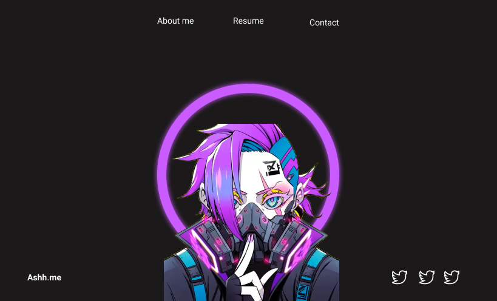
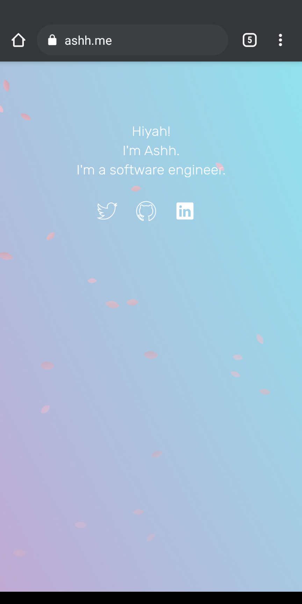
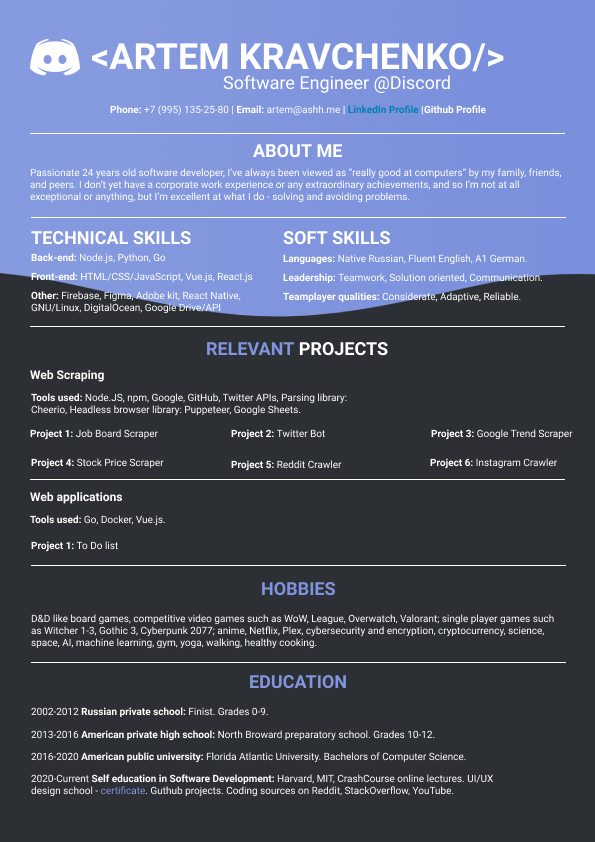
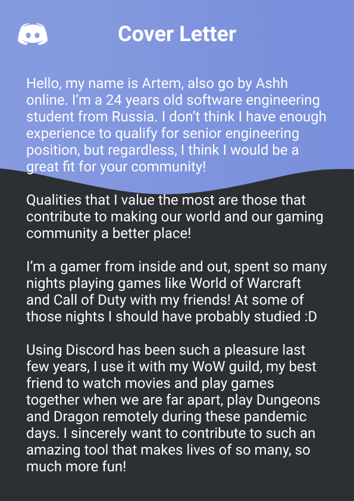

Another fresh attempt for a personal website portfolio, improving on previous goals.

attempt #1

And here's the final result! Really happy how it turned out on both mobile and desktop! Would ideally add a few animations, but it's something I will keep for the future!

ashh.me

suggestions: replace lots of div elements with canvas

Trying out to customize my Resume/CV for each company I want to work for the most :)

